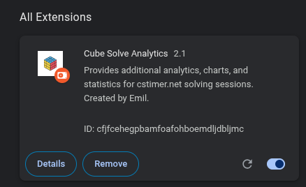
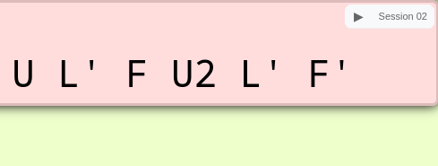
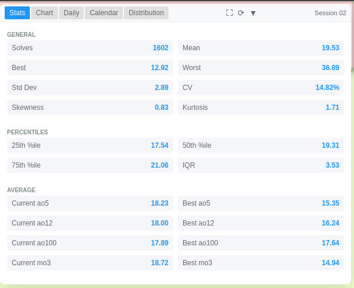
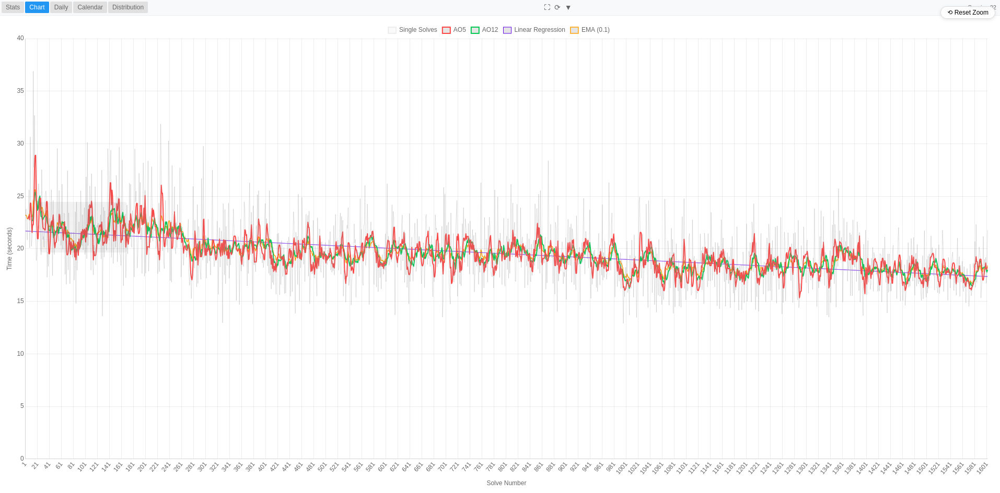
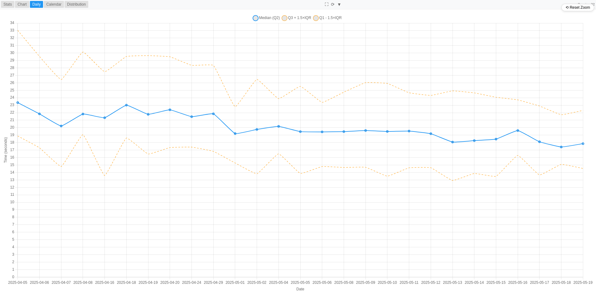
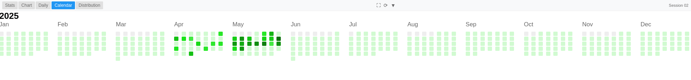
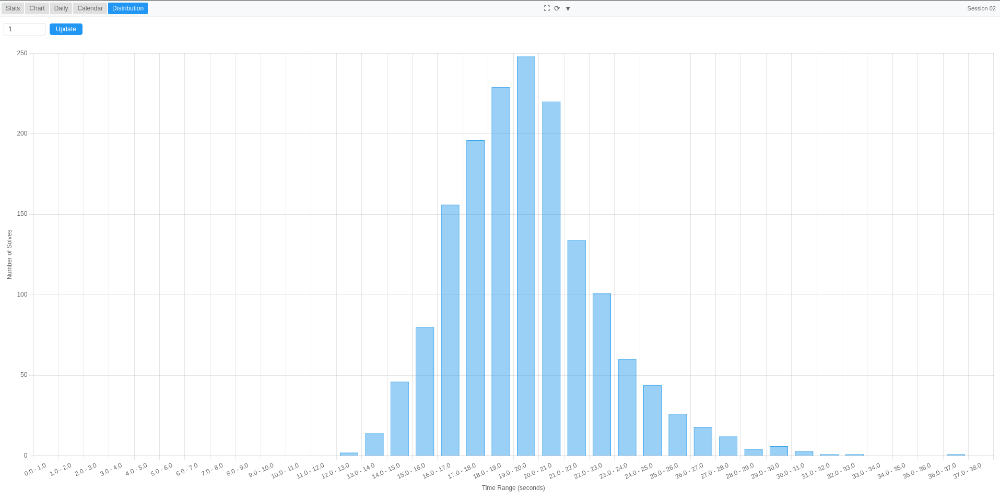

# Cube Solve Analytics

**Chrome extension** that enhances [cstimer.net](https://cstimer.net) with additional analytics, interactive charts, and detailed statistics for your Rubik’s Cube solving sessions. Created by Emil.

## Features

* **Statistics**: Mean, median, best, worst times, standard deviation, skewness, kurtosis.
* **Rolling averages**: AO5, AO12, AO100 sliding windows calculated according to WCA rules.
* **Trend analysis**: Linear regression trend line overlay.
* **Distribution visuals**: Histogram and boxplot to observe time distributions.
* **Calendar heatmap**: Daily solve counts displayed in a GitHub‑style calendar.
* **Interactive charts**: Zoom, pan, and reset controls via Chart.js and chartjs-plugin-zoom.
* **Customizable bins**: Adjust histogram bin width for distribution analysis.

## Installation

1. Clone this repository **or download it as a ZIP archive**:
   ```bash
   git clone https://github.com/emilcube/cube-solve-analytics.git
   ```

   Or, if you’re not using Git:
   * Click the green **“Code”** button
   * Choose **“Download ZIP”**
   * Then unzip the archive to a convenient folder on your computer

2. Open Chrome and go to `chrome://extensions/`.
3. Enable **Developer mode** in the top‑right corner.
4. Click **Load unpacked** and select the `cube-solve-analytics` folder.
5. You can see, that extension are loaded. Ensure the extension is enabled and visit [cstimer.net](https://cstimer.net) to see the analytics widget.



## Usage

* In the top-right corner, there's an expandable panel labeled "Session <your_current_session>".
If the label doesn't appear, try switching the website language to English on [cstimer.net](https://cstimer.net) (go to Option -> Language).
* Click the ▶️ toggle button to expand or collapse the analytics panel.
* Switch between **Stats**, **Chart**, **Daily**, **Calendar**, and **Distribution** tabs.
* Use the fullscreen ⛶ button for a larger view.
* Click 🔄 to refresh data after a new solve.
* Hover over calendar cells and chart points for detailed tooltips.
* Adjust histogram bin size via input and **Update** button.

## Important Note

This extension works exclusively with solve data stored in [cstimer.net](https://cstimer.net) **IndexedDB** storage.  
If your browser blocks or disables IndexedDB access for cstimer.net, the analytics widget will **not function**.

## Screenshots





*General stats*



*Single chart with multiple lines. You can zoom in/out using the mouse wheel, and select a specific area by holding Ctrl and dragging with the mouse. There is a Reset Zoom button. You can also toggle the visibility of individual lines by clicking on the chart legend*



*Daily statistics by day. Shows the median solve time for days with 5 or more solves. Hovering over a point also displays the number of solves for that day. The graph also shows the range boundaries of solves. The chart supports zooming and viewing specific sections*



*Solve heatmap. A more intense green color means a higher number of solves on that day. Hovering over a cell displays the date and the number of solves for the selected day*



*Distribution of solves by time. You can set any bin size in the input box; the default is 5 seconds. You can adjust the bin size using the arrow buttons to increase or decrease by 1 second, or you can enter any value manually, including decimals. Hovering over the chart displays the number of solves within the range and the percentage of total solves that range represents*

## License

* **This project** is licensed under the [GNU General Public License v3.0](LICENSE) (GPL‑3.0-or-later).
* **Third‑party libraries** (`Chart.js`, `chartjs-plugin-zoom`) are included under the **MIT License**.

---

© 2025 Emil
